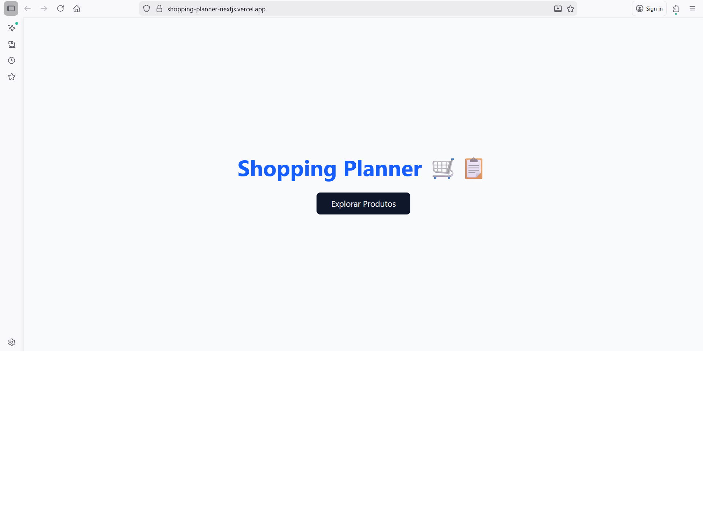

# Shopping Planner

Uma loja virtual fake integrada com um gerenciador de tarefas Kanban para planejar compras de forma inteligente.

**Features planejadas**:
- Lista de produtos (Fake Store API)
- Carrinho persistente
- Kanban de tarefas/compras (drag & drop)
- Gráficos de orçamento
- Dark mode

**Tech Stack**:
- Next.js 16 (App Router + Turbopack)
- TypeScript
- Tailwind CSS + shadcn/ui
- Zustand (estado global)
- dnd-kit (drag & drop)
- Recharts (gráficos)
- Fake Store API

**Como rodar localmente**:
```bash
npm install
npm run dev

## Demo
[Acesse o app aqui](https://shopping-planner-nextjs.vercel.app/)

